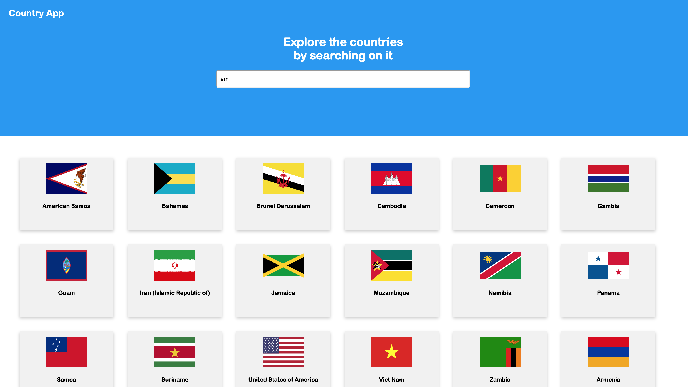
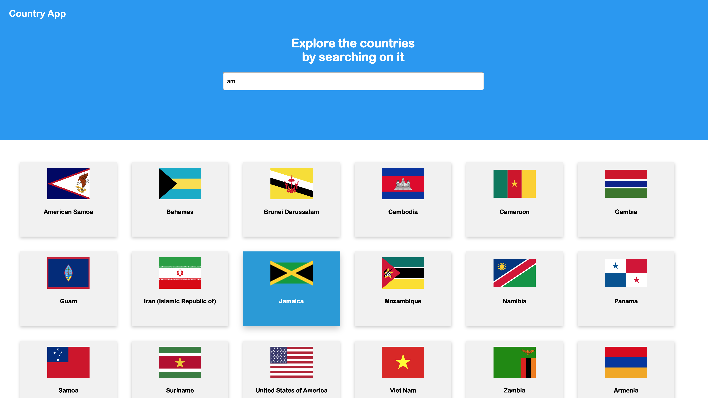
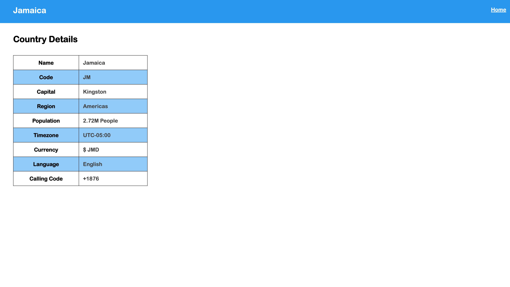
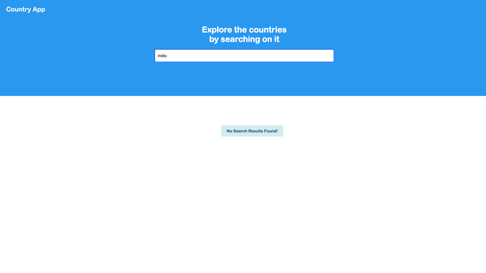

## Freshwork Frontend Assignment

### Demo Link: https://ajaysharvesh3.github.io/

### Project Structure

    ├── Freshworks-FrontEnd                    
    │   ├── src  
    |   |    ├── app.js
    |   |    ├── index.html
    |   |    ├── styles.css    
    |   |    ├── country-details
    |   |    |          ├── country-details.html
    |   |    |          ├── movie-details.js
    │   └── README.md  
    └── ...

## Project Details

### Description
A web application used to search countries and view the details of those countries. Whenever user types for countries in the search bar, then results will be populating in Cards and clicking on that will direct to the details page.

### Features and flows
+ `[Additional (Custom TypeAhead)]` In the search bar, while typing, results automatically updates every time, `no need of search button.`
+ Click on results (card), direct to `country-details` page and shows details about country.
+ `Details` are displayed in `Table View` so that it could be understandable and easy to read.
+ `[Additional]` Population data in details page is user understandable `Original Data: 1295210000` => `Displaying Data: 1.3B`
+ `[Additional]` After moving back to the previous home page, still shows the previous results and manage your searching time.

### Screenshots  
**TypeAhead Functionality - Home Page** 

***

**Hover Functionality**

***

**Table View - Country Details Page**

***

**Error Handling - Home Page**

***

### Run the project

Clone this project using git clone command, and view the `index.html` in a web browser.

(or)

Download the zip file, and extract it and then view the `index.html` in a web browser.
